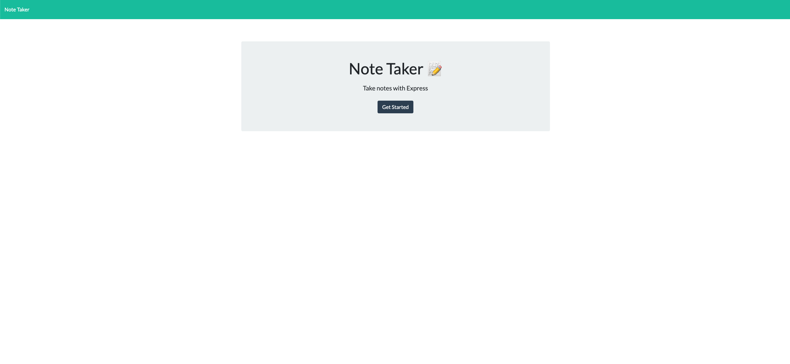
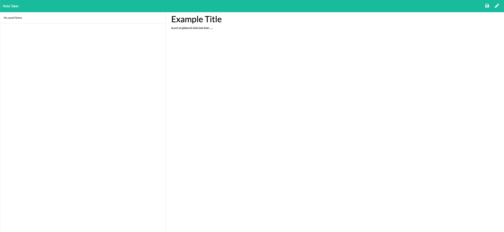
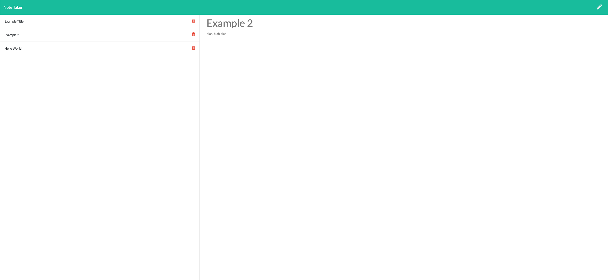

# Note Taker
A template for your Project

## Table of Contents
* [Introduction](#introduction) 
* [How it Works](#how-it-works)
* [Demo Images](#demo-images)
* [Contact](#contact)
* [Links](#links)

## Introduction
A note taker app that'll let you save notes.

## How it Works
You begin the app with the "Get Started" button which will direct you to another page. You can add a title and underneath begin writing anything you want. Top right youll have a "save" icon which will store your notes. The stored notes will be on the left side of the screen with a "trash" icon for deleting.

## Demo Images

 

  

  

## Contact
If you want to contact me you can reach me at banda_adrian@outlook.com.

## Links
[Heroku](https://note-taker-ab.herokuapp.com/)  
[Github Profile](https://github.com/banda-adrian)